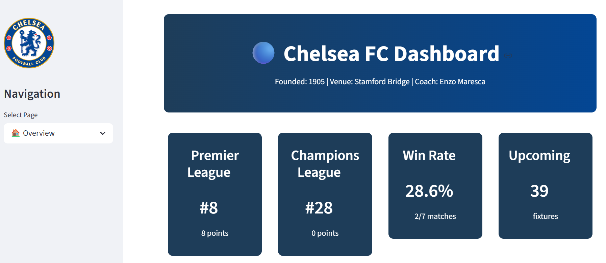
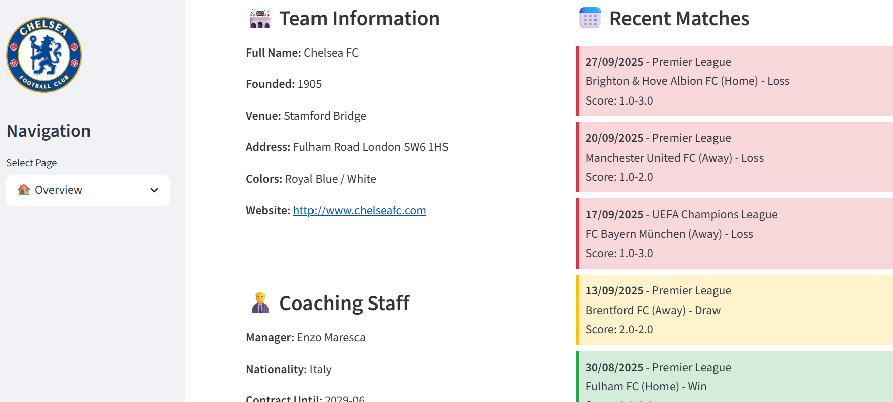
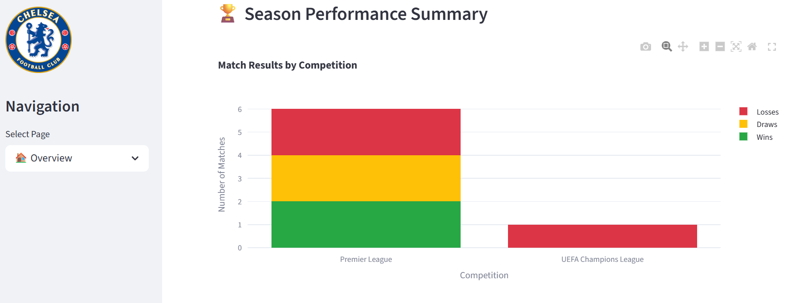
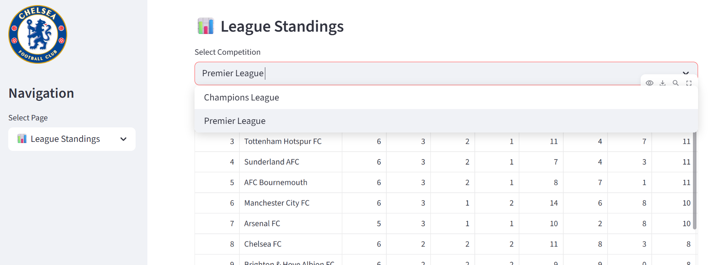
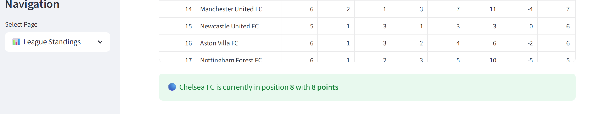
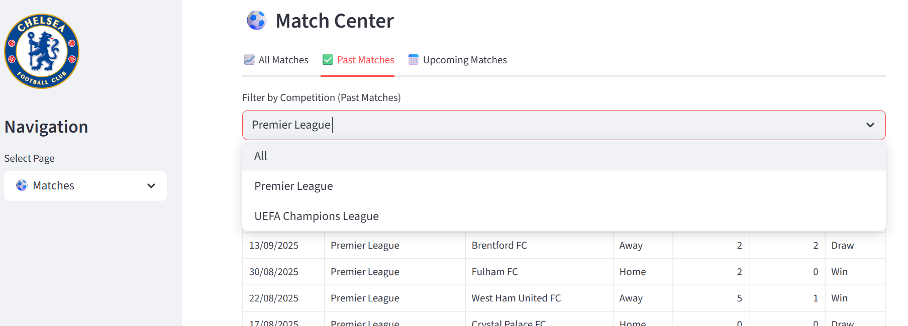
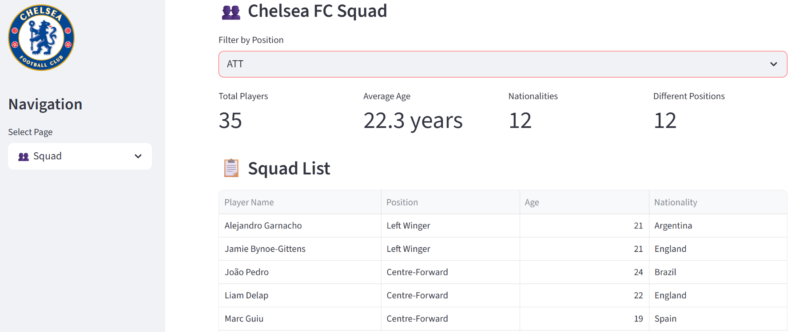
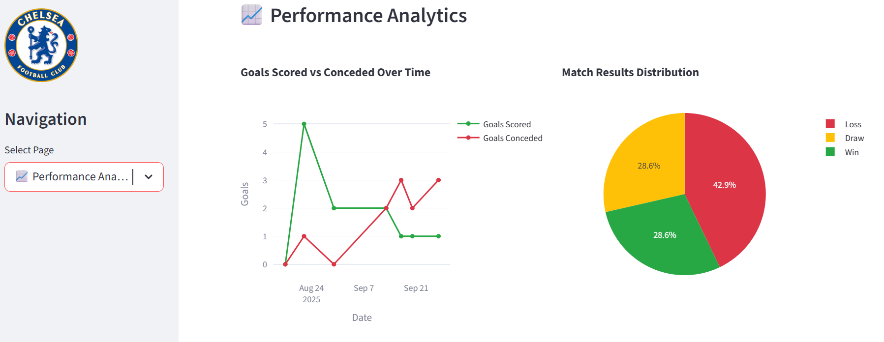
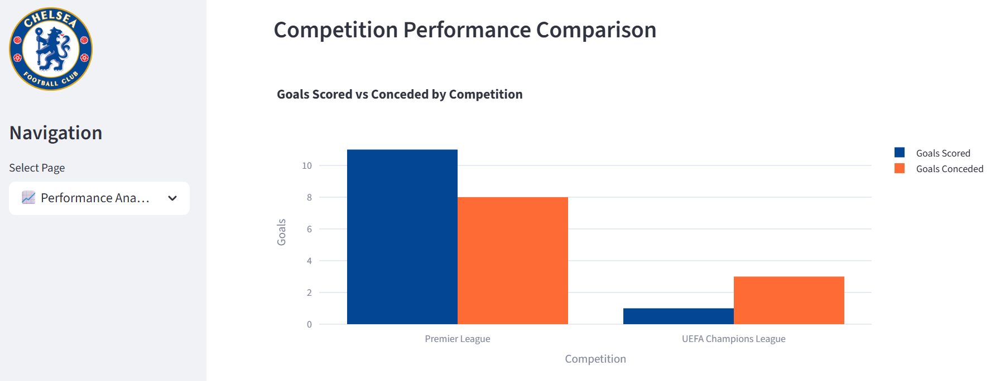
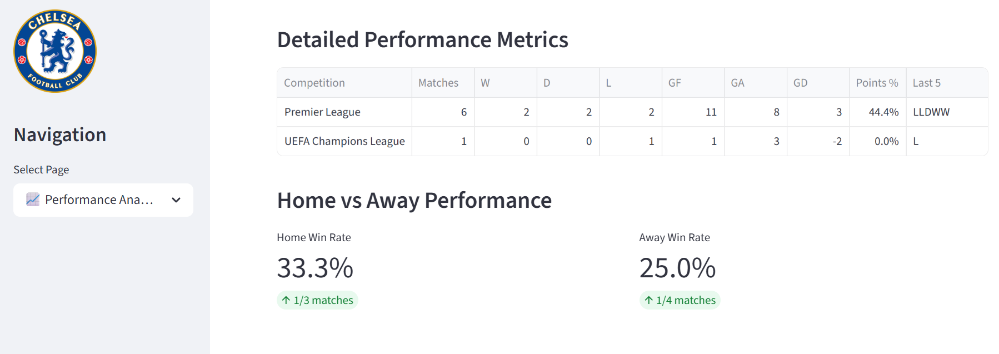

# ⚽ Chelsea Data Dashboard

## 📋 Overview

This project is an **end-to-end data engineering pipeline** and dashboard designed around Chelsea FC’s match data.

It demonstrates key skills in:

- **Data extraction** (Python, APIs, AWS Lambda)
- **Data storage** (PostgreSQL, AWS RDS)
- **Data transformation** (dbt)
- **Data visualisation** (Streamlit, AWS EC2)
- **Infrastructure as code** (Terraform, Docker, AWS)

The final product is a **Streamlit dashboard** that provides interactive insights into Chelsea’s matches, squad, standings, and performance trends, with **daily extraction** so data is up to date.

## 🚀 Features

- ✅ Automated data extraction from football APIs
- ✅ PostgreSQL database with dbt transformations
- ✅ Multi-page Streamlit dashboard with interactive charts and filters
- ✅ Deployable locally **or** to AWS (RDS + Lambda + EC2)
- ✅ Infrastructure provisioned with **Terraform**

## 🛠️ Installation and Setup

This project is split into multiple components, each housed in a separate subfolder.

### To run locally:

To correctly set up this project to run the dashboard locally, please follow the instructions detailed in the [dashboard folder README.md](./dashboard/README.md).

### To run on the cloud:

To correctly set up this project and deploy it to the cloud, please follow the instructions detailed in the [terraform folder README.md](./terraform/README.md).

## 📸 Screenshots

Below are examples of the Streamlit dashboard in action:

### 🏠 Overview

### 📊 League Standings

### ⚽ Matches

### 👥 Squad

### 📈 Performance Analytics

